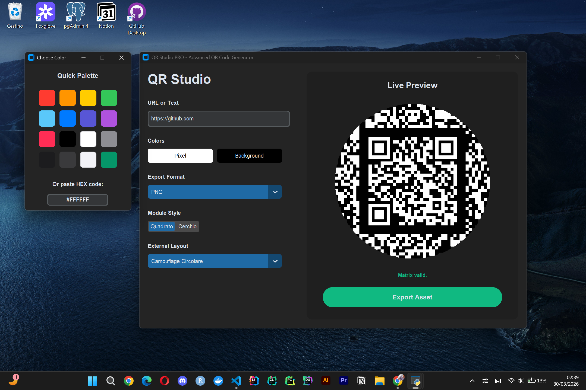
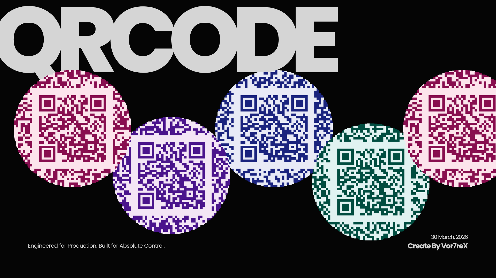

# QR Code Generation Studio |   

<br>

Most developers just type `import qrcode` and call it a day. **I didn't.**

This project is built on a strict **dual-engine architecture**, designed to bridge the gap between raw cryptographic theory and high-end production tools.

**1.The Hybrid Software (`QrCodeGenerator_Library.py`)**: Built for production. I offload the heavy data encoding to standard libraries for maximum speed, then hijack the raw binary matrix to enforce my own custom rendering pipeline. The result? Pixel-Raster (PNG/JPG) and native Vector (SVG) assets that standard modules simply cannot generate.

**2.The Scratch Software (`QrCodeGenerator_Scratch.py`)**: Built for absolute control. Zero external encoding dependencies. This is my implementation of the ISO/IEC 18004 standard. I manually compute Galois Field arithmetic, execute Reed-Solomon polynomial division, and dynamically scale the geometric matrix up to the maximum Version 40 (177x177 pixels) purely from scratch.



<br>

##  Under the Hood: How I Built It From Scratch?

In the `QrCodeGenerator_Scratch.py`, I recreated the entire QR standard relying purely on Python's native logic. Here is the theoretical pipeline implemented in the code:

### 1. Galois Field GF(2^8) & Polynomial Math
QR Codes don't just store data; they protect it using **Reed-Solomon Error Correction**. To calculate the parity bytes, the software implements Galois Field arithmetic. I pre-computed exponent and logarithm tables to perform polynomial multiplication and division strictly within the 255-byte hardware limit of the QR architecture.

### 2. Payload Interleaving (Breaking the Limit)
A single Galois Field block cannot exceed 255 bytes. To support massive payloads (up to ~3000 bytes in Version 40), the software implements **Block Interleaving**. It mathematically slices the data into smaller chunks (e.g., 38 blocks), calculates the Error Correction for each independently, and then "shuffles" them together like a deck of cards to ensure structural resilience against physical damage.

### 3. Dynamic Matrix Skeletons (V1 to V40)
A QR Code is not just a square; it's a dynamic grid that grows by 4 modules per version. The engine calculates the spatial coordinates to automatically draw:

- **Finder & Timing Patterns:** To anchor the scanner.

- **Alignment Swarms:** Calculating up to 46 simultaneous alignment targets (for V40) based on official ISO coordinate tables to prevent lens distortion on massive grids.

- **Version & Format Blocks:** Applying BCH code generation to explicitly declare the mask and version to the scanner.

### 4. The Zig-Zag Routing & XOR Masking
Finally, the bitstream is injected into the matrix starting from the bottom-right, moving upwards in a zig-zag pattern, dodging all structural patterns. To prevent large clumps of black or white pixels from confusing the camera, an **XOR Mask** (e.g., inverting pixels where `(row + col) % 2 == 0`) is applied dynamically across the entire data field.

<br>




## Rendering Features 

**Custom XML Vector Engine:** Generates pure SVG strings dynamically. Capable of computing complex `<clipPath>` nodes and matrix masking for "Camouflage" layouts without relying on heavy external vector libraries.

**Advanced Raster Processing:** Utilizes Pillow to paint matrices pixel-by-pixel. Features automated Alpha-channel flattening to ensure perfect transparency-to-solid-color merging for JPEG exports.

**UI Design:** A fully responsive, hardware-accelerated interface built with `customtkinter`. 
Includes a custom OS-independent Hex/RGB color picker and a debounced live-preview rendering pipeline.

<br>

## Technologies Stack

| **Core Stack** | **Implementation Details** |
| :--- | :--- |
|  | Galois Field logic, polynomial division, matrix routing, and binary stream manipulation. |
|  | Modern, dark-mode compatible GUI framework for the desktop application. |
|  | High-performance image processing, circular cropping, and Raster layer compositing. |
|  | Native string generation for lossless, web-ready vector graphic outputs. |
<br>

## 📦 Quick Start

1. Clone the repository:

    ```bash
    git clone https://github.com/Vor7reX/QRCode-Studio.git
    ```

2.  Navigate to the project directory:

    ```bash
    cd QrcodeGenerator
    ```

3. Install the required dependencies:

   ```bash
   pip install -r requirements.txt
   ```
4. Launch the application

    For the production-ready GUI (Library-assisted encoding + Custom Rendering)

        
        python src/QrCodeGenerator_Library.py
        
    For the software implemented from-scratch GUI

        python src/QrCodeGenerator_Scratch.py
  

<br>

---
<div align="left">
<p valign="middle">
Created by <b>Vor7reX</b>
<a href="https://pokemondb.net/pokedex/latias">

</a>
</p>
</div>
